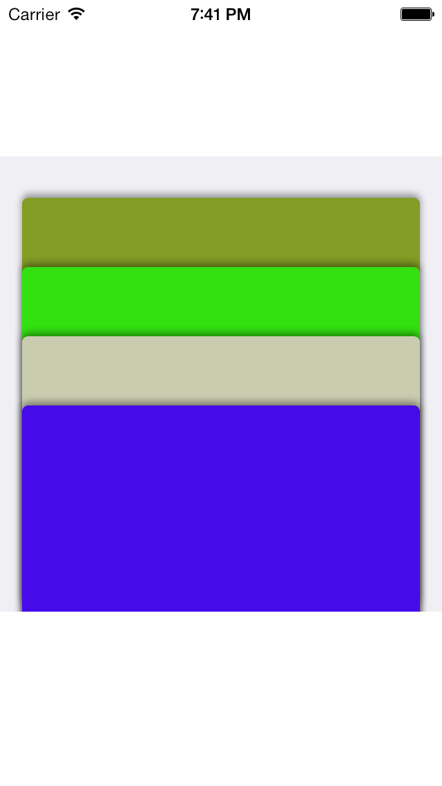
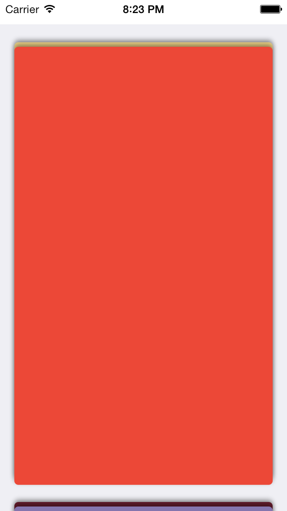

SSStackedPageView
=================

Inspired by Passport App and Reminders App for iOS 7, this is designed to have a stacked page view that uses reusable pages for efficiency. Easily scroll through UIImageViews, UIViews or your custom View with this one do-it-all class.
=======
Inspired by Passport App and Reminders App for iOS 7, this is designed to have a stacked page view that uses reusable pages for efficiency. Easily scroll through UIImageViews, UIViews or your custom View with this one do-it-all class. <b>built for iOS7</b>


SSStackedPageView uses a scroll view to manage through your large list of views. By either selecting or dragging the view up, you divide the stack and highlight that view. Each view is customized to the length of the SSStackedPageView. For efficiency, I make use of a reusable array of pages so that scrolling is fast and beautiful.

|                       |                       |
|  -------------------  |  ------------------- |
|   |   |
|                       |                       |

####Implementation:

This class has the delegate ```SSStackedViewDelegate``` that has the following methods:

```
///method for setting the current page at the index
- (UIView*)stackView:(SSStackedPageView *)stackView pageForIndex:(NSInteger)index;

///total number of pages to present in the stack
- (NSInteger)numberOfPagesForStackView:(SSStackedPageView *)stackView;

///handler for when a page is selected
- (void)stackView:(SSStackedPageView *)stackView selectedPageAtIndex:(NSInteger) index;
```

All three are required to create the stacked view. The first ```stackView:pageForIndex``` is most similar to tableView:rowForIndexPath: in that you'll want to presen tthe view that will be presented for that index. Next is the somewhat trivial ```numberOfPagesForStackView:``` which simply informs the StackedPageView how many elements to expect (and how many times ```stackView:pageForIndex``` is called). 

Lastly, we have ```stackView:selectedPageAtIndex:``` method which will be your handler for when the page is selected. 

Known Bugs:
- Rotation brings odd results when pages are reused. Please Fork and Pull request if you find a solution or other bugs.


Thanks, and Enjoy!
